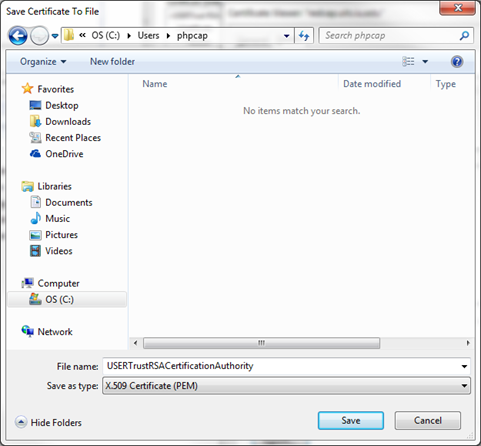

CA Certificate File
=====================================================================

The CA (Certificate Authority) certificate file is needed so that PHPCap can verify that
the REDCap instance it is connecting to is actually the instance that
was specified.

In PHPCap, it is possible to set SSL verification to false, so that
a CA certificate file is not required, however, this is insecure, and
is not recommended. At most, setting SSL verification to false should
only be used for initial testing with non-critical data.

It is possible that your system may already be set up to use a correct CA certificate file.
This can be tested by trying to access a project will SSL verification set to true, but with
no CA certificate file specified, for example:

```php
<?php

require('PHPCap/autoloader.php');

$apiUrl = '';
$apiToken = '1234567890A1234567890B1234567890';

$sslVerify = true;
$project = RedCapProject($apiUrl, $apiToken, $sslVerify);
$project->exportProjectInfo();
```

If this works, then that would indicate that your system is already set up with a CA certificate
file. If it fails, and you get an error message about a security certificate, such as

> SSL certificate problem: self signed certificate in certificate chain

then your system is not already set up.


Creating a CA Certificate File with Firefox
--------------------------------------------------

To use the Firefox web browser to create a CA (Certificate Authority) certificate file for use with PHPCap, use the following steps:

1. Access your REDCap site with Firefox.
2. Click on the padlock icon, and then the connection, and then "More Information".
3. Click on the "Security" tab, if it is not already selected.  
      
4. Click on the "View Certificate" button
5. Click on the "Detail" tab of the "Certificate Viewer" dialog.  
      
6. Select the top entry in the "Certificate Hierarchy" box.
7. Click the "Export..." button.
8. In the "Save Certificate to File" window that should appear:
    1. navigate to where you want to save the file
    2. change the name of the file if you don't want to use the default name
    3. set "Save as type" to "X.509 Certificate (PEM)"
    4. click on the "Save" button.  
       

