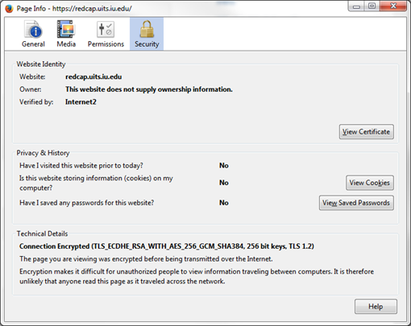
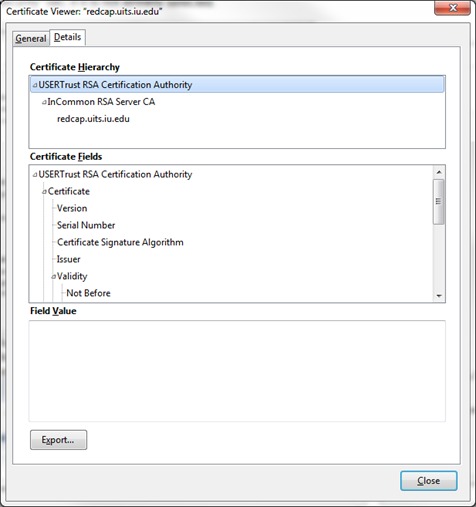

CA Certificate File Instructions - Firefox
==============================================

To use the Firefox web browser to create a CA (Certificate Authority) certificate file for use with PHPCap, use the following steps:

1. Access your REDCap site with Firefox.
2. Click on the padlock icon, and then the connection, and then "More Information".
3. Click on the "Security" tab, if it is not already selected.  
      
4. Click on the "View Certificate" button
5. Click on the "Detail" tab of the "Certificate Viewer" dialog.  
      
6. Select the top entry in the "Certificate Hierarchy" box.
7. Click the "Export..." button.
8. In the "Save Certificate to File" window that should appear:
  1. navigate to where you want to save the file
  2. change the name of the file if you don't want to use the default name
  3. set "Save as type" to "X.509 Certificate (PEM)"
  4. click on the "Save" button.  
       